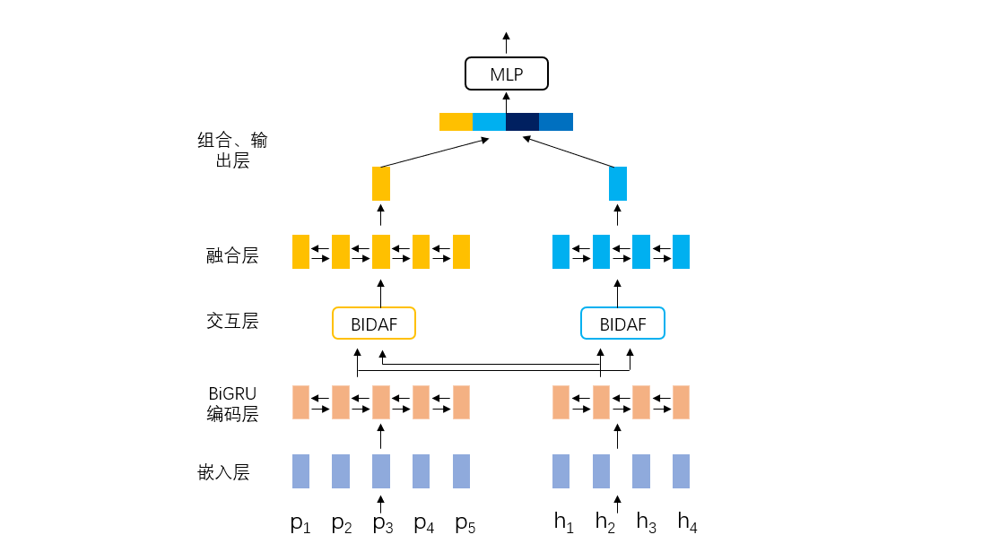

# 基于微软开源项目NeuronBlocks构建中文文本蕴含深度学习模型

# 1. 案例介绍

## 1.1 使用场景

[文本蕴含技术](https://www.jiqizhixin.com/articles/2016-12-06-2)在众多语义相关的自然语言处理（NLP）任务和日常生活中有着广泛的应用。在问答系统中，文本蕴含技术可以生成候选答案，或对用其他方法生成的候选答案进行筛选排序；在机器翻译评价领域，可以利用机器译文和标准译文的互相蕴含程度来对机器翻译系统的性能进行评估；在学生作业评分任务中，学生的作答与标准答案之间的蕴含关系也可以指示学生答案的完善程度等等。

## 1.2 中文文本蕴含任务（NLI）介绍

随着自然语言处理(Natural LanguageProcessing, NLP)领域研究的不断深入，如何让机器能够真正地理解自然语言，而不是仅仅简单地处理语句的表层信息，渐渐成为了许多学者面临的问题。实现对文本深层次理解，是自然语言处理研究最主要也是最重要的目的之一。因为在获取了文本的语义后，一旦获得了它们之间的推理关系，这些文本便不再互相孤立，而是彼此联系起来，构成一张语义推理网络，从而促使机器能够真正理解并应用文本的语义信息。文本间的推理关系，又称为文本蕴含关系 (TextualEntailment)，作为一种基本的文本间语义联系，广泛存在于自然语言文本中。简单的来说文本蕴含关系描述的是两个文本之间的推理关系，其中一个文本作为前提（premise），另一个文本作为假设（hypothesis），如 果根据前提（premise）能够推理得出假设（hypothesis），那么就说两者之间存在蕴含关系。

## 1.3 NeuronBlocks

NeuronBlocks是一个NLP深度学习建模工具包，可帮助工程师构建用于NLP任务的神经网络模型训练的端到端管道。该工具包的主要目标是将NLP深度神经网络模型构建的开发成本降到最低，包括训练阶段和推理阶段。NeuronBlocks由两个主要组件组成：Block Zoo和Model Zoo。Block Zoo提供常用的神经网络组件作为模型架构设计的构建块，如BiLSTM、BiGRU、Transformer、CNN等。在Model Zoo中，针对常见的NLP分类任务，如情感分析、文本分类、序列标注、机器阅读理解等，以JSON配置文件的形式为其提供了一套NLP模型。本案例中，中文文本蕴含任务本质也是一种分类任务，所以我们选择Model Zoo来快速构建中文文本蕴含（NLI）深度学习算法模型。

## 1.4 案例价值

* 对中文文本蕴含任务（NLI）有一定认识和理解

* 掌握微软开源项目NeuronBlocks使用方法

* 利用NeuronBlocks快速构建并训练、测试NLI深度学习模型


# 2. 先修知识

* [深度学习基础知识](https://www.bilibili.com/video/BV1TE411u7u9?from=search&seid=14909906822391857993)

* [GRU循环神经网络](https://arxiv.org/abs/1406.1078)、[注意力方法](https://arxiv.org/abs/1611.01603)等

* Python编程语言、[NeuronBlocks](https://github.com/microsoft/NeuronBlocks)

* [Pytorch](https://pytorch.org/)深度学习框架


# 3. 推荐学习时长

推荐学习时长为3.5小时


# 4. 环境与工具

## 4.1 软件环境

*注: NeuronBlocks支持 **Python 3.6**及以上*

1. Clone本项目： 
    ```bash
    git clone https://github.com/heavenAsk/NeuronBlocks
    ```

2. 安装Python依赖包：
    ```bash
    pip install -r requirements.txt
    ```

3. 安装PyTorch ( 本案例使用的是**PyTorch 1.2.0+cu92**):
    
    对于 **Linux** ，运行以下命令：
    ```bash
    # CUDA 9.2
    pip install torch==1.2.0+cu92 torchvision==0.4.0+cu92 -f https://download.pytorch.org/whl/torch_stable.html
    ```
    对于 **Windows** ，建议按照[PyTorch官方安装教程](https://pytorch.org/get-started/locally/)通过Conda安装PyTorch。


4. 本案例使用的**Linux**系统Python3.6环境：
 ```bash
   nltk==3.4.1
   gensim==3.7.2
   tqdm==4.31.1
   numpy==1.16.3
   scikit-learn==0.20.3
   ftfy==5.5.1
   jieba==0.39
   torch==1.2.0+cu92
   torchvision=0.4.0+cu92
    
 ```
 

## 4.2 硬件环境

	本案例中使用GPU显卡加速，配置为显存>=11 GB

# 5. 案例详解

## 5.1 案例总体流程
* 数据获取。获取中文文本蕴含任务数据集，并划分训练集、验证集、测试集；下载中文预训练词向量。

* 模型构建。JSON配置文件的形式搭建模型，主要用到其Embedding, BiGRU,BiAttFlow等构建块。  

* 模型训练。训练模型的步骤和做法。  

* 模型测试。 
	
**<span class="mark">数据集版权说明：本实践使用互联网开源数据集，请勿用于商业用途。</span>**

## 5.2 数据获取

### 5.2.1 中文文本蕴含数据

我们利用的是开源的中文文本蕴含数据集，数据下载地址```https://github.com/liuhuanyong/ChineseTextualInference```,数据集**train.txt**主要包含三种文本蕴含关系：**entailment、contradiction、 neutral**, 数据示例如下所示，第一个文本句子为为前提（premise），第二个文本句子为假设（hypothesis），其次是前提和假设的蕴含关系，每一行代表一个样本，以```\t```分隔。数据量级在42万左右，类别比例**entailment：contradiction：neutral = 1：1：1**，不存在数据类别不平衡问题。
```
一个年轻人在呼啦圈。	这位老人正在呼啦圈。	contradiction
两个人正在大教堂或清真寺里交谈。	两个人在谈话	entailment
穿着黑色外套的妇女边看报纸边等着洗衣服。	有个女人在洗衣店。	neutral

```


```python
import random

def split_data():
    # 中文文本蕴含数据集只提供了train.txt，为了方便测试验证我们的模型，将该数据集划分训练集、验证集、测试集
    samples = {"neutral": [], "contradiction": [], "entailment": []}
    with open("train.txt", "r", encoding="utf-8") as fout:
        for idx, line in enumerate(fout):
            contents = line.strip().split("\t")
            if len(contents) < 3:
                continue
            samples[contents[-1]].append(line)
    print("neutral: {}, contradiction: {}, entailment: {}".format(len(samples["neutral"]), len(samples["contradiction"]), len(samples["entailment"])))

    def split_hepler(data):
        # 根据data的6：2：2划分train, dev, test
        length = len(data)
        train = data[: int(length * 0.6)]
        dev = data[int(length * 0.6): int(length * 0.8)]
        test = data[int(length * 0.8): ]
        return train, dev, test

    neu_train, neu_dev, neu_test = split_hepler(samples["neutral"])
    cont_train, cont_dev, cont_test = split_hepler(samples["contradiction"])
    ent_train, ent_dev, ent_test = split_hepler(samples["entailment"])
    train = neu_train + cont_train + ent_train
    dev = neu_dev + cont_dev + ent_dev
    test = neu_test + cont_test + ent_test
    random.shuffle(train)
    random.shuffle(dev)
    random.shuffle(test)

    def save_data(data, filename):
        with open(filename, "w", encoding="utf-8") as fout:
            for idx, line in enumerate(data):
                fout.write(line)
    save_data(train, "dataset/chinese_nli/cnli_train.txt")
    save_data(dev, "data/chinese_nli/cnli_dev.txt")
    save_data(test, "data/chinese_nli/cnli_test.txt")
    
# split_data()

```

### 5.2.2 下载中文预训练词向量
运用已在大规模语料上预训练得到的中文词向量初始化词向量参数，提升模型的性能。我们此处选用的**搜狗新闻**语料预训练的**Word**300的词向量，下载并解压缩获得词向量文件**sgns.sogou.word**，词向量下载地址```https://github.com/Embedding/Chinese-Word-Vectors#pre-trained-chinese-word-vectors```。

## 5.3 模型构建

### 5.3.1 模型整体架构
针对中文文本蕴含任务，本案例实现的是经典的循环神经网络+注意力方法模型，循环神经网络为[BiGRU](https://arxiv.org/abs/1406.1078)，注意力方法为[BIDAF](https://arxiv.org/abs/1611.01603)。模型主要包含以下几个模块：嵌入层、BiGRU编码层、注意力交互层、融合层、组合和输出层。接下来会进行详细讲解如何利用NeuronBlocks以Json文件的形式构建这些模块。模型结构如下图所示，p指的是前提（premise），h指的假设（hypothesis）


### 5.3.2 嵌入层
嵌入层主要是将文本分词后，利用词表查找功能转化为相应的词向量，为后续模型的输入做准备。该层中以**Embedding**定义，**conf**设置词向量参数，本案例中我们使用搜狗新闻预训练得到的词向量，所以**dim**应与保持预训练的维度保持一致设为300，**cols**输入文本分别为前提（premise）和假设（hypothesis）。
```
{
    "layer": "Embedding",
    "conf": {
      "word": {
        "cols": ["premise_text", "hypothesis_text"],
        "dim": 300
      }
    }
}
```

### 5.3.3 BiGRU编码层
利用双向GRU对向量化后的premise和hypothesis进行编码，获得更高层的语义信息表示。

```
# 设置模型输入，例如premise_text经过向量化变为premise
"model_inputs": {
      "premise": ["premise_text"],
      "hypothesis": ["hypothesis_text"]
}

# 对premise和hypothesis进行dropout操作，可以设置dropout系数
{
    "layer_id": "premise_dropout",
    "layer": "Dropout",
    "conf": {
        "dropout": 0
    },
    "inputs": ["premise"]
},
{
    "layer_id": "hypothesis_dropout",
    "layer": "Dropout",
    "conf": {
        "dropout": 0
    },
    "inputs": ["hypothesis"]
},

# 利用BiGRU对dropout后的premise进行编码，此处可设置其隐藏层节点大小，层数，dropout系数等
{
    "layer_id": "premise_bigru",
    "layer": "BiGRU",
    "conf": {
        "hidden_dim": 128,
        "dropout": 0.3,
        "num_layers": 2
    },
    "inputs": ["premise_dropout"]
},
# 利用对premise编码的BiGRU对hypothesis再次编码，两者共享参数。
{
    "layer_id": "hypothesis_bigru",
    "layer": "premise_bigru",
    "inputs": ["hypothesis_dropout"]
},
```


### 5.3.4 交互层
利用BiAttFlow注意力方法使premise和hypothesis进行交互，得到premise和hypothesis信息相互感知的上下文表征。

```
{
    "layer_id": "premise_attn",
    "layer": "BiAttFlow",
    "conf": {
    },
    "inputs": ["premise_bigru","hypothesis_bigru"]
},
{
    "layer_id": "hypothesis_attn",
    "layer": "BiAttFlow",
    "conf": {
    },
    "inputs": ["hypothesis_bigru", "premise_bigru"]
}

```


### 5.3.5 融合层

利用BiGRU对交互后premise和hypothesis再次编码，使两者信息融合得更加充分。

```
{
    "layer_id": "premise_bigru_final",
    "layer": "BiGRU",
    "conf": {
        "hidden_dim": 128,
        "num_layers": 1
    },
    "inputs": ["premise_attn"]
},
{
    "layer_id": "hypothesis_bigru_final",
    "layer": "BiGRU",
    "conf": {
        "hidden_dim": 128,
        "num_layers": 1
    },
    "inputs": ["hypothesis_attn"]
}

```

### 5.3.6 组合、输出层

```
# premise 和 hypothesis 最大化池化操作，得到对应的句子向量
{
    "layer_id": "premise_pooling",
    "layer": "Pooling",
    "conf": {
      "pool_axis": 1,
      "pool_type": "max"
    },
    "inputs": ["premise_bigru_final"]
},
{
    "layer_id": "hypothesis_pooling",
    "layer": "Pooling",
    "conf": {
      "pool_axis": 1,
      "pool_type": "max"
    },
    "inputs": ["hypothesis_bigru_final"]
},

# premise 和 hypothesis 拼接、做差、点积，获得两者的语义向量表示，输入到多层感知机中进行分类。
{
    "layer_id": "comb",
    "layer": "Combination",
    "conf": {
        "operations": ["origin", "difference", "dot_multiply"]
    },
    "inputs": ["premise_pooling", "hypothesis_pooling"]
},
{
    "output_layer_flag": true,
    "layer_id": "output",
    "layer": "Linear",
    "conf": {
      "hidden_dim": [128, 3],
      "activation": "PReLU",
      "batch_norm": true,
      "last_hidden_activation": false
    },
    "inputs": ["comb"]
}

# 模型损失函数
"loss": {
"losses": [
  {
    "type": "CrossEntropyLoss",
    "conf": {
      "size_average": true
    },
    "inputs": ["output","label"]
  }
]
},

# 模型评价指标
"metrics": ["accuracy"]

```

### 5.3.7 模型其他参数设置
到此我们将模型结构用Json参数的形式构建完成，这里来设置模型的其他一些重要参数

```
# NeuronBlocks支持英文和中文
"language": "Chinese",

# 训练集、验证集、测试集文件路径及预训练词向量的文件路径
"inputs": {
"use_cache": false,
"dataset_type": "classification",
"data_paths": {
  "train_data_path": "./dataset/chinese_nli/cnli_train.txt",
  "valid_data_path": "./dataset/chinese_nli/cnli_dev.txt",
  "test_data_path": "./dataset/chinese_nli/cnli_test.txt",
  "predict_data_path": "./dataset/chinese_nli/cnli_test.txt",
  "pre_trained_emb": "./dataset/sogou_embed/sgns.sogou.word"
}

# 优化器、学习率、批次大小，训练轮数等超参数设置
"optimizer": {
  "name": "SGD",
  "params": {
    "lr": 0.2,
    "momentum": 0.9,
    "nesterov": true
  }
},
"lr_decay": 0.95,
"minimum_lr": 0.005,
"epoch_start_lr_decay": 1,
"use_gpu": true,
"batch_size": 256,
"batch_num_to_show_results": 100,
"max_epoch": 6,
"steps_per_validation": 1000,
"max_lengths": {
    "premise": 32,
    "hypothesis": 32
}
```

## 5.4 模型训练

*提示: 在下文中, **PROJECTROOT**表示本项目的根目录。*

1. 数据准备： 
    - 将划分后的训练集、验证集、测试集放置在指定的 PROJECTROOT/dataset/chinese_nli/ 目录下
    - 预训练词向量放在 PROJECTROOT/dataset/sogou_embed/ 目录
 
 
2. Json文件准备：Json模型配置文件放在 PROJECTROOT/model_zoo/nlp_tasks/chinese_nli/


3. 训练中文文本蕴含任务模型：
    - 进入**PROJECTROOT**目录下
    - 命令行运行命令：python train.py --conf_path=model_zoo/nlp_tasks/chinese_nli/conf_chinese_nli_bigru_biAttnflow.json 
    - 或者指定GPU：CUDA_VISIBLE_DEVICES=1 python train.py --conf_path=model_zoo/nlp_tasks/chinese_nli/conf_chinese_nli_bigru_biAttnflow.json
    

## 5.5 模型测试
模型测试更简单
   - 进入**PROJECTROOT**目录下
   - 运行命令：CUDA_VISIBLE_DEVICES=1 python test.py --conf_path=model_zoo/nlp_tasks/chinese_nli/conf_chinese_nli_bigru_biAttnflow.json
    

# 6. 总结
   * 本案例中除了刚开始的数据划分用到了python代码，整个模型训练、测试流程没有写一行代码，可见Neuronblocks的强大之处
   * 本案例完整版已上传至github，[项目地址](https://github.com/heavenAsk/NeuronBlocks)
    
